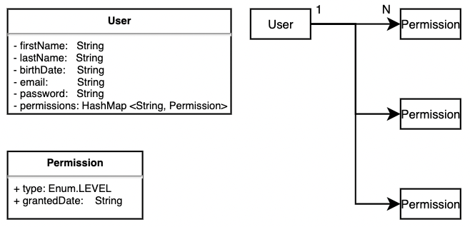

# REST API endpoints that manages users and associated permissions.

## Requirements

1. A user should have at least the following attributes:
- family name
- given name
- birthdate
- email
- password

2. A user's permission should have at least the following attributes:
- type
- granted date

3. The API should provide the endpoints to satisfy at least the following functional requirements:
- list all users
- add user
- remove user
- get single user
- grant permission for a user
- revoke permission for a user
- <mark>search users by family name <– this will be a stretch goal</mark>

*Please keep in mind that the purpose is not solely to provide a working solution. We are looking for you to demonstrate the principles and practices you  feel are important in software engineering: dependency management, testing, project structure, data modelling, etc.

## Environment

- Run the API App as JVM
	- Java 11
	- Maven ver 3.8.1

- Run the API App as container process by Docker
	- Docker runtime

## Get Started

- Clone the project into your remote or localhost

		$ gh repo clone masashik/userManagement
		$ cd userManagement/userManagement

 - Option 1. Launch the API server (Jetty) from source code

		$ mvn clean compile exec:java

 - Option 2. Launch the API server (Jetty) from JAR file

	<mark>(You need to skip maven test phase by supplying -DskipTests because maven test requires another JVM instance for this project, Or you can have the JVM instance with Option 1. above)</mark>

		$ mvn clean compile package -DskipTests 
		$ java -jar userManagement-1.0-SNAPSHOT-jar-with-dependencies.jar

 - Option 3. Launch the API server (Jetty) from Docker

		$ docker build -t usermanagement:v1 .
		$ docker run -d -p 8000:8000 usermanagement:v1

 - The API server is now running at port 8000 and try hitting the endpoints and some users.

## Available API endpoints

###### HTTP GET /users - List All Users
Request:
	
	curl -H "Content-Type: application/json" http://localhost:8000/users | jq
	
Response:
	
	[
		{
			"id": "4cb4ca08-8ff6-4282-a4ab-a4ac40ab87b9",
			"firstName": "First",
			"lastName": "Last",
			"birthDate": "2020-01-01",
			"email": "first@last.com",
			"password": "password"
		},
		{
			"id": "d2eea50a-8340-489b-ae1a-bd4d555a69c8",
			"firstName": "Second",
			"lastName": "Second Last",
			"birthDate": "1987-11-13",
			"email": "second@last.ca",
			"password": "password"
		},
		{
			"id": "218b1ade-8e0b-43f7-a574-e57abf60335d",
			"firstName": "Third",
			"lastName": "Third Last",
			"birthDate": "2016-10-18",
			"email": "third@last.com",
			"password": "password"
		},
		{
			"id": "3e7f0cb1-4586-403d-9ee7-3624fc4acc0f",
			"firstName": "Masashi",
			"lastName": "Kobayashi",
			"birthDate": "1989-10-23",
			"email": "masashi@kobayashi.com",
			"password": "password"
		}
	]

###### HTTP POST   /users - Add new user
Request:
	
	curl -i -X POST -H "Content-Type: application/json" http://localhost:8000/users \
	-d '{
	 "firstName":"First",
	 "lastName":"Last",
	 "birthDate":"1999-11-02",
	 "email":"first@last.com",
	 "password":"secret"
	}';
	
Response:
	
	HTTP/1.1 201 Created
	Date: Fri, 13 Aug 2021 23:46:25 GMT
	Content-Type: application/json
	Transfer-Encoding: chunked
	Server: Jetty(9.4.31.v20200723)
	
	{
	  "id":"d7c54a1d-f269-42f3-80c4-0e7bbec4b764",
	  "firstName":"First",
	  "lastName":"Last",
	  "birthDate":"1999-11-02",
	  "email":"first@last.com",
	  "password":"secret"
	}

###### HTTP DELETE /users - Remove single user
Request:
	
	curl -i -X DELETE -H "Content-Type: application/json" http://localhost:8000/users \
	-d '{
	 "id":"4cb4ca08-8ff6-4282-a4ab-a4ac40ab87b9",
	 "firstName":"First",
	 "lastName":"Last",
	 "birthDate":"1999-11-02",
	 "email":"first@last.com",
	 "password":"password"
	}'
	
Response:

	HTTP/1.1 200 OK
	Date: Fri, 13 Aug 2021 23:53:49 GMT
	Content-Type: application/json
	Transfer-Encoding: chunked
	Server: Jetty(9.4.31.v20200723)
	{
	  "id":"4cb4ca08-8ff6-4282-a4ab-a4ac40ab87b9",
	  "firstName":"First",
	  "lastName":"Last",
	  "birthDate": "2020-01-01",
	  "email": "first@last.com",
	  "password":"password"
	}

###### HTTP GET    /user/:id - Get single user
Request:

	curl -H "Content-Type: application/json" \
	http://localhost:8000/user/4cb4ca08-8ff6-4282-a4ab-a4ac40ab87b9

Response:

	{
	  "id":"4cb4ca08-8ff6-4282-a4ab-a4ac40ab87b9",
	  "firstName":"First",
	  "lastName":"Last",
	  "birthDate":"2020-01-01",
	  "email":"zeno@makeanart.com",
	  "password":"password"
	}

###### HTTP POST   /user/:id/grant/:permission - Grant permission for a user
Request:

	curl -i -X POST -H "Content-Type: application/json" \
	http://localhost:8000/user/218b1ade-8e0b-43f7-a574-e57abf60335d/grant/NORMAL

Response:

	HTTP/1.1 200 OK
	Date: Sat, 14 Aug 2021 00:15:51 GMT
	Content-Type: application/json
	Transfer-Encoding: chunked
	Server: Jetty(9.4.31.v20200723)
	
	{
	  "id": "218b1ade-8e0b-43f7-a574-e57abf60335d",
	  "firstName": "Third",
	  "lastName": "Third Last",
	  "birthDate": "2016-10-18",
	  "email": "third@last.com",
	  "password": "password"
	  "permission":
	  {
	    "permittedLevel":"NORMAL",
	    "grantedDate":"Fri Aug 13 20:15:51 EDT 2021"
	  }
	}

###### HTTP POST /user/:id/revoke/:permission - Revoke permission from a user
Request:

	curl -i -X POST -H "Content-Type: application/json" \
	http://localhost:8000/user/218b1ade-8e0b-43f7-a574-e57abf60335d/revoke/ADMIN

Response:

	HTTP/1.1 200 OK
	Date: Sat, 14 Aug 2021 00:24:42 GMT
	Content-Type: text/html;charset=utf-8
	Transfer-Encoding: chunked
	Server: Jetty(9.4.31.v20200723)
	
	{
	  "id":"218b1ade-8e0b-43f7-a574-e57abf60335d",
	  "firstName": "Third",
	  "lastName": "Third Last",
	  "birthDate": "2016-10-18",
	  "email": "third@last.com",
	  "password": "password"
	}

###### HTTP GET /users/:familyName - List all users containing the family name
Request:

	curl -H "Content-Type: application/json" http://localhost:8000/users/Last

Response:

	[
		{
			"id": "4cb4ca08-8ff6-4282-a4ab-a4ac40ab87b9",
			"firstName": "First",
			"lastName": "Last",
			"birthDate": "2020-01-01",
			"email": "first@last.com",
			"password": "password"
		},
		{
			"id": "d2eea50a-8340-489b-ae1a-bd4d555a69c8",
			"firstName": "Second",
			"lastName": "Second Last",
			"birthDate": "1987-11-13",
			"email": "second@last.ca",
			"password": "password"
		},
		{
			"id": "218b1ade-8e0b-43f7-a574-e57abf60335d",
			"firstName": "Third",
			"lastName": "Third Last",
			"birthDate": "2016-10-18",
			"email": "third@last.com",
			"password": "password"
		}
	]

### Dependency management 

 		Apache Maven is used for managing dependent resources.
		<?xml version="1.0" encoding="UTF-8"?>
		
		<project xmlns="http://maven.apache.org/POM/4.0.0" xmlns:xsi="http://www.w3.org/2001/XMLSchema-instance"
			xsi:schemaLocation="http://maven.apache.org/POM/4.0.0 http://maven.apache.org/xsd/maven-4.0.0.xsd">
		<modelVersion>4.0.0</modelVersion>
		
		<groupId>com.masashik.app</groupId>
		<artifactId>userManagement</artifactId>
		<version>1.0-SNAPSHOT</version>
		
		<name>userManagement</name>
		<url>https://github.com/masashik/userManagement</url>
		
		<properties>
			<project.build.sourceEncoding>UTF-8</project.build.sourceEncoding>
		</properties>
		
		<dependencies>
			<dependency>
				<groupId>junit</groupId>
				<artifactId>junit</artifactId>
				<version>4.11</version>
				<scope>test</scope>
			</dependency>
			<dependency>
				<groupId>com.sparkjava</groupId>
				<artifactId>spark-core</artifactId>
				<version>2.9.3</version>
			</dependency>
			<dependency>
				<groupId>com.google.code.gson</groupId>
				<artifactId>gson</artifactId>
				<version>2.8.0</version>
			</dependency>
			<dependency>
				<groupId>io.rest-assured</groupId>
				<artifactId>rest-assured</artifactId>
				<version>3.0.7</version>
			</dependency>
			<dependency>
				<groupId>io.rest-assured</groupId>
				<artifactId>json-path</artifactId>
				<version>3.0.7</version>
			</dependency>
			<dependency>
				<groupId>io.rest-assured</groupId>
				<artifactId>json-schema-validator</artifactId>
				<version>3.0.7</version>
			</dependency>
			<dependency>
				<groupId>io.rest-assured</groupId>
				<artifactId>xml-path</artifactId>
				<version>3.0.7</version>
			</dependency>
			<dependency>
				<groupId>org.hamcrest</groupId>
				<artifactId>hamcrest-all</artifactId>
				<version>1.3</version>
				<scope>test</scope>
			</dependency>
		</dependencies>
		
		<build>
			<plugins>
				<plugin>
					<groupId>org.codehaus.mojo</groupId>
					<artifactId>exec-maven-plugin</artifactId>
					<version>3.0.0</version>
					<configuration>
						<mainClass>com.masashik.app.UserManagementMainApp</mainClass>
					</configuration>
				</plugin>
				<plugin>
					<groupId>org.apache.maven.plugins</groupId>
					<artifactId>maven-compiler-plugin</artifactId>
					<version>3.8.0</version>
					<configuration>
						<release>11</release>
					</configuration>
				</plugin>
				<plugin>
					<groupId>org.apache.maven.plugins</groupId>
					<artifactId>maven-assembly-plugin</artifactId>
					<version>3.1.0</version>
					<configuration>
						<descriptorRefs>
							<descriptorRef>jar-with-dependencies</descriptorRef>
						</descriptorRefs>
						<archive>
							<manifest>
								<addClasspath>true</addClasspath>
								<mainClass>com.masashik.app.UserManagementMainApp</mainClass>
							</manifest>
						</archive>
					</configuration>
					<executions>
						<execution>
							<id>assemble-all</id>
							<phase>package</phase>
							<goals>
								<goal>single</goal>
							</goals>
						</execution>
					</executions>
				</plugin>
			</plugins>
		</build>
		</project>

### Testing

	Test scripts covered the following topics to assure the API requirements.

	UserManagementAppTest.getAllUserAndReturnHTTP200
	UserManagementAppTest.getSingleUserAndReturnHTTP200
	UserManagementAppTest.addNewUserAndReturnHTTP201
	UserManagementAppTest.getSingleNonExistentUserAndReturnHTTP404
	UserManagementAppTest.removeNonExistingUserAndReturnHTTP404
	UserManagementAppTest.addMultipleNewUsersTest
	UserManagementAppTest.addNewUserVerifyUserBody
	UserManagementAppTest.findUserByFamilyNameAndReturnHTTP200
	UserManagementAppTest.removeExistingUserWithBadRequestBodyAndReturnHTTP404
	UserManagementAppTest.revokePermissionUserAndReturnHTTP200
	UserManagementAppTest.removeExistingUserAndReturnHTTP200
	UserManagementAppTest.grantPermissionUserAndReturnHTTP200

### Data modelling

### Project structure

	 ~/Project/userManagement/ [main*] tree
	├── LICENSE
	├── README.md
	└── userManagement
	├── Dockerfile
	├── pom.xml
	├── src
	    ├── main
	    │   └── java
	    │       └── com
	    │           └── masashik
	    │               └── app
	    │                   ├── Response.java
	    │                   ├── StatusResponse.java
	    │                   ├── UserManagementMainApp.java
	    │                   ├── controllers
	    │                   │   └── UserController.java
	    │                   ├── exceptions
	    │                   ├── filters
	    │                   │   └── JsonParsingFilter.java
	    │                   ├── models
	    │                   │   ├── Permission.java
	    │                   │   └── User.java
	    │                   ├── services
	    │                   │   ├── UserService.java
	    │                   │   └── UserServiceImpl.java
	    │                   └── transformers
	    │                       └── JsonResponseTransformer.java
	    └── test
	        └── java
	            └── com
	                └── masashik
	                    └── app
	                        └── UserManagementAppTest.java

### TODO

- [ ] Add API Spec documentation for setting up a developer friendly environment(Ex. Swagger Slate)
- [ ] Adding a database layer to enable connection to MySQL database for data persistency
- [ ] Unit Test for implementation layer
- [ ] Integration Test for service layer
- [ ] End-to-end Testing for edge layer (API endpoints)
- [ ] Mock testing for end-to-end API testing
- [ ] Create develop and feature branch for gitflow
- [ ] Enable logging for service health observability
- [ ] JWT based API endpoints protection
- [ ] Rate limiting for service availability
- [ ] Resilience handling by circuit breaker
- [x] Develop test case for unit, integration, and end-to-end (regression)
- [x] Containerize the API App.

# Extra - SCIM compliant

Request:

	/scim/users?filter=userName eq "Kobayashi"&startIndex=1&count=100
	GET /scim/users?filter=userName%20eq%20%22Kobayashi%22&startIndex=1&count=100

	HTTP/1.1
	User-Agent: Okta SCIM Client 1.0.0
	Authorization: <Authorization credentials>

Response (Success):

	HTTP/1.1 200 OK
	Date: Tue, 10 Sep 2019 01:49:39 GMT
	Content-Type: text/json;charset=UTF-8

	{
		"schemas": ["urn:ietf:params:scim:api:messages:2.0:ListResponse"],
		"totalResults": 0,
		"startIndex": 1,
		"itemsPerPage": 0,
		"Resources": []
	}

Response (Fail/Error):

	HTTP/1.1 404 Not Found
	Date: Tue, 10 Sep 2019 01:58:03 GMT
	Content-Type: text/html; charset=UTF-8
	
	{
		"schemas": ["urn:ietf:params:scim:api:messages:2.0:Error"],
		"detail": "User not found",
		"status": 404
	}

Request:

	POST /scim/v2/Users HTTP/1.1
	User-Agent: Okta SCIM Client 1.0.0
	Authorization: <Authorization credentials>

	{
		"schemas": ["urn:ietf:params:scim:schemas:core:2.0:User"],
		"userName": "test.user@okta.local",
		"name": {
			"givenName": "Test",
			"familyName": "User"
		},
		"emails": [{
			"primary": true,
			"value": "test.user@okta.local",
			"type": "work"
		}],
		"displayName": "Test User",
		"locale": "en-US",
		"externalId": "00ujl29u0le5T6Aj10h7",
		"groups": [],
		"password": "1mz050nq",
		"active": true
	}

Reference: https://developer.okta.com/docs/reference/scim/scim-20
